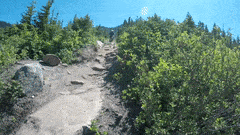

 
  

<h1 align="center"> Bike Sharing Demand Prediction </h1>
<h3 align="center"> AlmaBetter Verfied Project - <a href="https://www.almabetter.com/"> AlmaBetter School </a> </h5>

 

<h2> Summary</h2>

Rental bike sharing idea is introduced in many cities for mobility comfort. Availability of these rental bikes needs to be taken care of to reduce the waiting time for people and ensuring their comfort. We will be working on predicting the bike count required at each hour for ensuring the supply of the rental bikes as per demand.

<h2>Objective</h2>

The usage of rental bikes to enhance mobility experience over the different regions of the world has become common. But to ensure that the stable supply of these bikes should be taken care of, which is very much required for customer satisfaction. It will help companies involved in the supply of rental bikes to increase their revenue as the rental bikes will be provided to customers when required reducing the waiting time for customers. Businesses can use this approach to predict the rental bike count required for a particular time of day and supply 

<!-- CREDITS -->
<h2 id="credits"> :scroll: Credits</h2>

 Sakshi Dhyani  | Avid Learner | Data Scientist | Machine Learning Engineer | Deep Learning enthusiast

